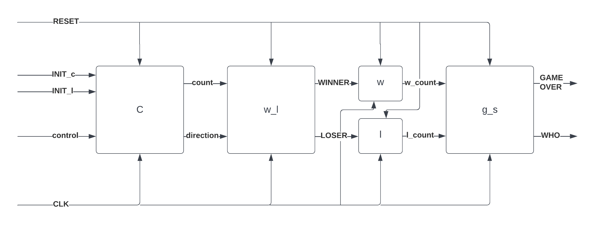

# Digital-Verification
Here I implement a multi-mode counter that can:
- Count upwards
- Count downwards
- Count with variable step
- Can be loaded with an initial value
- Can be reset

Then using the count of this counter, we simulate a game 
between two players (WINNER and LOSER) then display the 
winning player.

## Design

### The design is split into four main modules:
### 1. The counter module (c):
Changes the count after each clock and outputs the direction of counting (up or down) and the current count.
### 2. The win_lose module (w_l):
Outputs high on all winner bits when all input count bits are high and low on all LOSER bits whenever all count bits are low.
### 3. The count_signal module (w, l):
We have two instances of this module, one called w and the other is l. w module takes WINNER signal as its input and w_count as its output. While l module takes LOSER signal as its input and l_count as its output.

Each of these modules receives a signal (WINNER in case of w and LOSER in case of l) and the output of the module is incremented whenever the input signal is high.
### 4. The game_state module(g_s): 
This last module takes both w_count and l_count, and the owner of whichever signal reaches the preset limit first is declared as winner. The outputs of the module are:
- #### GAMEOVER:
    Set when game ends.
- #### WHO:
    Declaring the identity of the winner.

## Assumptions
- INIT and RESET are synchronous signals.
- When INIT is set, its value is loaded in the next cycle and the counter proceeds to continue its operation in the next cycle.
- Overflows are not counted for the WINNER or the LOSER.
- If an INIT value is loaded and the max value is reached, the counting restarts at zero.
- User can freely set the size of the counter and the winning score.

### Note
This was part of a class project of a digital verification course, Taught by Dr. Ayman Wahba and Eng. Rizk Tawfik.
